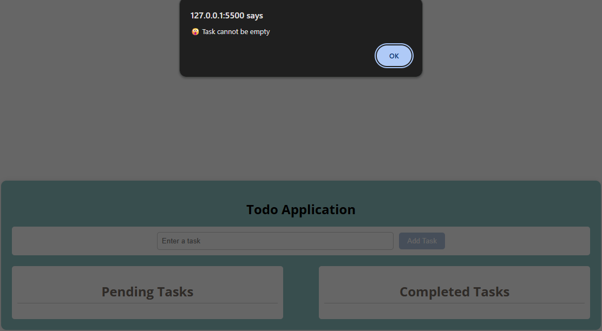
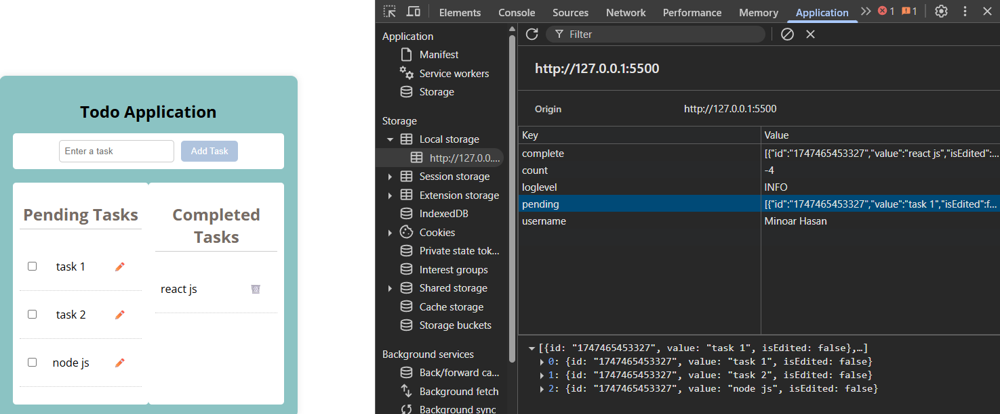

# To-Do-App

I developed a [To Do App](https://vanila-js-to-do-application.netlify.app/) using Vanilla JavaScript (ES6), HTML5, CSS3, and DOM manipulation, with data persistence handled via the Web Storage API (localStorage). Although there is no backend, the app mimics a full REST-like experience with complete CRUD functionality, custom validation, and real-time feedback via alert notifications.

## 🔧 Tech Used:

JavaScript (ES6+) – For logic, event handling, and DOM manipulation.

HTML5 & CSS3 – For responsive and clean UI design.

Web Storage API – For persistent local data storage (no server required).

## Features

📥 GET (Read) Features
Users can fetch and view all existing todo tasks from `localStorage`.

If no tasks are found, an empty list view is displayed.

➕ POST (Create) Features
Users can enter a new todo task via an input from.

Validation:

Input must not be empty.

Task length must be `≤ 40` characters, else an info alert is shown.

On successful submission:

The task is stored in localStorage and shown in the pending task.

After clicking the checkbox, a pending task should be transferred to a completed task.

✏️ PUT (Update) Features
Users can edit existing pending tasks by clicking edit (✏️) icon and through an edit input field.

Validation:

Input must not be empty.

Task length must be `≤ 40` characters, else an info alert is shown.

After a successful update:

The updated task is visually highlighted with bold text.

🗑️ DELETE (Remove) Features
Users can delete any todo task from the completed task by clicking delete (🗑️) icon.

After successful deletion:

The task is removed from localStorage as well.

## Deployment

I have deployed my project on the Netlify website. Visit & investigate the application using the following hosted link.

[Todo App ](https://vanila-js-to-do-application.netlify.app/)

## Lessons Learned

- Using flags like isEditing to switch behavior

- Validating user input before performing actions

- UI dynamically using JavaScript

- Importance of saving app state to localStorage

## Challenges

- Challenges of Using One Button for Add and Edit

- **Managing Button State and Text:**
  The button must clearly indicate whether it’s in “Add” or “Edit” mode by dynamically changing its label and behavior, to avoid confusing the user.

- Preventing Multiple Concurrent Edits:\*\*
  The app should restrict users from editing more than one task at a time to maintain data integrity and prevent conflicting changes.

- **Handling User Actions Smoothly:**
  Providing intuitive features like inline editing, cancel options, and input focus is necessary to create a seamless experience and avoid frustration during task updates.

---

Want me to help you expand these points or explain them with code examples?

## Run Locally

Clone the project

git clone https://github.com/Minoar98/To-do-list

Go to the project directory

cd To-do-list

I am using a Visual Studio Code extension named Live Share.

steps

To mouse right click on the index.html file,
click the Go Live option,
,
,
steps

Mouse right click on the index.html file,

click the go live option,

http://127.0.0.1:5500/index.html

will be opened in the browser.
,
,

Happy testing!

## Authors

- Github: [@Syed Minoar Hasan](https://github.com/Minoar98)
- Email: [minoarhasan@gmail.com](mailto:minoarhasan@gmail.com)
- Linkedin: [Syed Minoar Hasan](https://www.linkedin.com/in/syed-minaor-hasan-3404b617a/)

## Related

Here are some related projects

To be disclosed later
